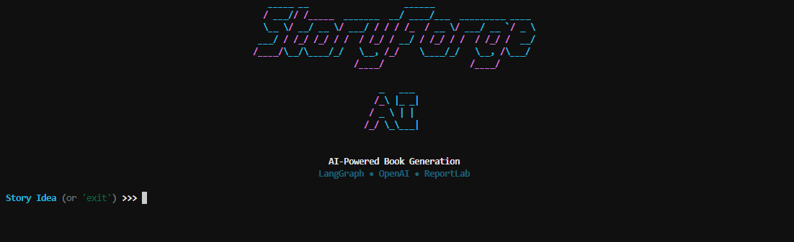
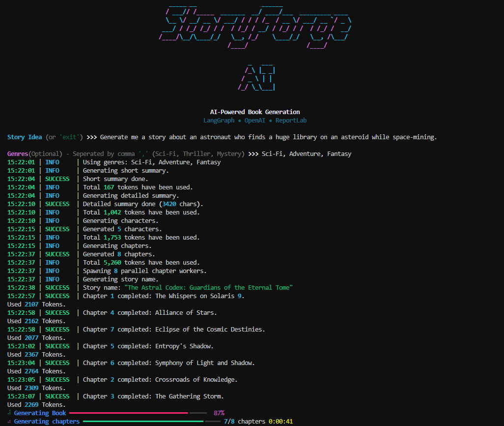
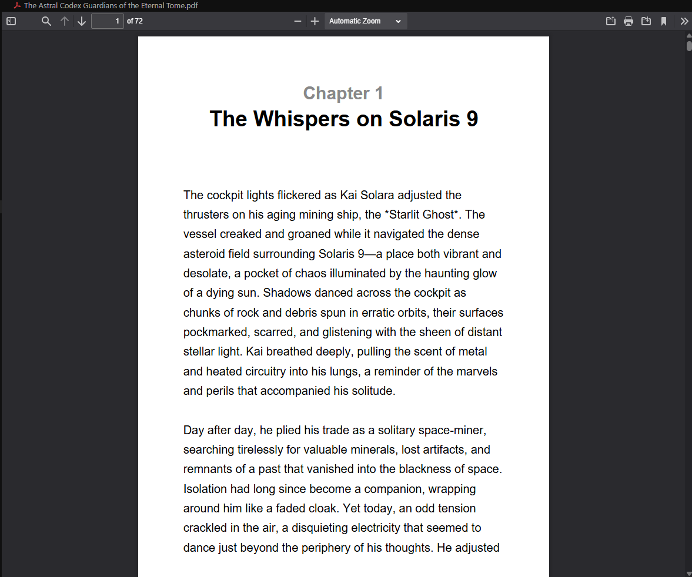

# StoryForge AI

`storyforge-ai` is a LangGraph-powered command-line Python application that turns a short story idea into a complete fictional book and exports it as an A5 PDF.

The application uses LangGraph to orchestrate a multi-step generation workflow, LangChain OpenAI for LLM calls, Pydantic for structured model outputs, Rich and Loguru for terminal feedback, and ReportLab for PDF generation.

## Features

- Generates a complete fictional book from a single story prompt.
- Supports optional comma-separated genre input.
- Selects random genres when no genres are provided.
- Produces a short summary, detailed outline, character profiles, chapter plan, story title, and full chapter text.
- Uses structured LLM outputs for characters, chapters, and title generation.
- Writes chapters in parallel through LangGraph worker nodes.
- Shows real-time logs and workflow progress during generation.
- Exports the final book as an A5 PDF using the generated story title.
- Sanitizes generated filenames before writing output.

## Tech Stack

- Python 3.11+
- LangGraph
- LangChain OpenAI
- Pydantic
- ReportLab
- Rich
- Loguru
- python-dotenv

## Project Structure

```text
.
+-- main.py             # Entry point and LangGraph workflow
+-- requirements.txt    # Python dependencies
+-- README.md           # Project documentation
+-- examples/           # Sample generated PDF outputs and prompt info
+-- .gitignore          # Local and generated files excluded from Git
```

The examples/ folder includes sample StoryForge-generated PDFs along with the prompts used to create them.

## Requirements

- Python 3.11 or newer
- An OpenAI API key

## Installation

Clone the repository:

```bash
git clone https://github.com/Vansh-Choyal/storyforge-ai.git
cd storyforge-ai
```

Create and activate a virtual environment:

```bash
python -m venv .venv
```

Windows:

```bash
.venv\Scripts\activate
```

macOS/Linux:

```bash
source .venv/bin/activate
```

Install dependencies:

```bash
pip install -r requirements.txt
```

## Configuration

Create a `.env` file in the project root:

```env
OPENAI_API_KEY=sk-proj....
```

The application currently uses these OpenAI models:

- `GPT-4o` for planning, summaries, characters, chapters
- `GPT-4o-mini` for long-form chapter writing, and title generation.

## Usage

Run the application:

```bash
python main.py
```

Enter a story idea when prompted:

```text
Enter your story idea (or 'exit') >>>
```

Optionally enter one or more genres as a comma-separated list:

```text
Sci-Fi, Mystery, Adventure
```

If no genre is provided, the application randomly selects three genres from:

```text
Sci-Fi, Mystery, Action, Drama, Horror, Romance, Thriller, Adventure, Fantasy
```

Type `exit` or `quit` at the story prompt to close the application.

## Screenshots

### Startup



### Generating Progress



### Final Preview



## Example Output

The generated PDF is saved in the project directory using the generated story title as the filename:

```text
Generated Story Title.pdf
```

See `examples/` for complete books generated by StoryForge AI.

Characters that are invalid in Windows filenames are removed automatically.

## How It Works

The LangGraph workflow runs the following stages:

1. Generate a short story summary from the prompt and genres.
2. Generate a detailed story outline.
3. Generate structured character profiles.
4. Generate a structured chapter plan.
5. Generate the story title.
6. Fan out chapter-writing workers in parallel.
7. Sort completed chapters by chapter number.
8. Build the final A5 PDF with ReportLab.

## Disclaimer

StoryForge AI generates fictional content using large language models. Generated output may contain inaccuracies, inconsistencies, or unexpected content and should be reviewed before publication.

## License

This project is licensed under the MIT License. See the LICENSE file for details.